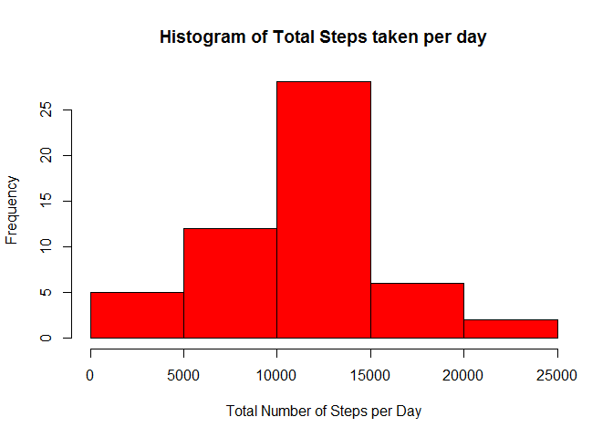
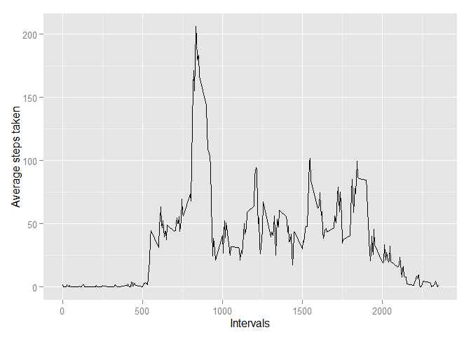
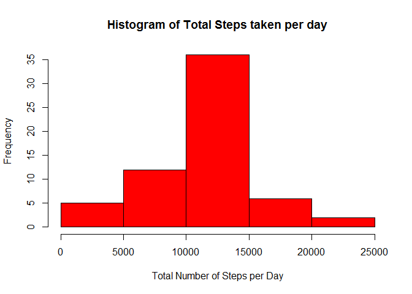
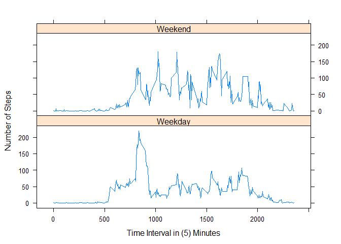

# Reproducible Research: Peer Assessment 1
Cloudmage  
Saturday, January 17, 2015  


## Requirements

In order for you to use this code you will need the following installed

The activity.zip file should be copied into your R or R Studio working directory.
The zip file should also be unzipped for use.


R Packages that should be installed.  You can use the install.packages("NNN") where NNN is the name of the package from the list below.

* data.table
* ggplot2
* plyr
* lattice


```r
## Load the data.table library
## Information for data.table package at http://cran.r-project.org/web/packages/data.table/index.html
library(data.table)
```

```
## Warning: package 'data.table' was built under R version 3.1.2
```

```r
## Load the ggplot2 library
## Information for ggplot2 package at http://cran.r-project.org/web/packages/ggplot2/index.html
library(ggplot2)
```

```
## Warning: package 'ggplot2' was built under R version 3.1.2
```

```r
## Load the plyr library 
## Information for plyr package at http://cran.r-project.org/web/packages/plyr/index.html
library(plyr)
```

```
## Warning: package 'plyr' was built under R version 3.1.2
```

```r
## Load the lattice library 
## Information for lattice package at http://cran.r-project.org/web/packages/lattice/index.html
library(lattice)
```


## Loading and preprocessing the data

The first task is to load the actvity.csv file into R in order to query the data.

Data is loaded to a variable called **dataset**


```r
#Load the "activity.csv" file into a variable called dataset
## Reference Manual for read.csv at http://stat.ethz.ch/R-manual/R-devel/library/utils/html/read.table.html
dataset <-read.csv ("activity.csv")
```

This loads a dataframe with 17,568 Observations of 3 Variables

The next stage is to tidy the data by formatting the date field to be a date. This uses the **as.Date** function to format the date into a Year, Month, Day format.


```r
##Set the date as a true date field using the as.Date function
## Reference Manual for as.date at http://stat.ethz.ch/R-manual/R-devel/library/base/html/as.Date.html
dataset$date <- as.Date(dataset$date,"%Y-%m-%d")
```


## What is mean total number of steps taken per day?

There are 2 questions for this part of the assignment. There is also an instruction:

* For this part of the assignment, you can ignore the missing values in the dataset.

To meet this the data from the variable **dataset** is aggregated to count the steps and date and write this to a new variable called **meanstepdata**. The R code also removes any NA values in the dataset using the na.rm function.


```r
## Aggregate the data from dataset to a new vairable called meanstepdata
## Reference Manual for aggregate at https://stat.ethz.ch/R-manual/R-devel/library/stats/html/aggregate.html
meanstepdata <- aggregate(steps~date,dataset, na.rm=TRUE, FUN=sum)
```


**Question 1** 
 Make a histogram of the total number of steps taken each day

Using the data extracted for this part of the assignment in the **meanstepdata** variable plot this as a Histogram using the R hist function.


```r
## Use the hist base plotting function in R to plot a histogram graph
## Reference Manual for hist at http://stat.ethz.ch/R-manual/R-devel/library/graphics/html/hist.html
hist(meanstepdata$steps,col="red",xlab="Total Number of Steps per Day", 
      ylab="Frequency", main="Histogram of Total Steps taken per day")
```

 

**Question 2**
 Calculate and report the mean and median total number of steps taken per day

The following code calculates the mean steps storing the results in to a variable called **meandataset**


```r
## Calculate the mean of the meanstepdata variable into a new variable  called meandataset
## Reference Manual for mean at http://stat.ethz.ch/R-manual/R-devel/library/base/html/mean.html
meandataset <- mean(meanstepdata$steps)

## print the meandataset variable
meandataset
```

```
## [1] 10766.19
```

This loads a dataframe with 53 Observations of 2 Variables

This returns the result of **10766.19**


The following code calculates the median steps storing the results in to a variable called **mediandataset**


```r
## Calculate the median of the meanstepdata variable into a new variable called mediandataset
## Reference Manual for median at https://stat.ethz.ch/R-manual/R-patched/library/stats/html/median.html
mediandataset <- median(meanstepdata$steps)

## print the mediandataset variable
mediandataset
```

```
## [1] 10765
```

This loads a dataframe with 53 Observations of 2 Variables

This returns the result of **10765**


## What is the average daily activity pattern?

There are 2 questions for this part of the assignment.

To meet this the data from the variable **dataset** is aggregated to count the steps and date and write this to a new variable called **averagedataset**. The R code also removes any NA values in the dataset using the na.rm function.


```r
##Create a new data frame called averagedataset from the dataset variable setting a new variable for interval
## Reference Manual for data.frame at http://stat.ethz.ch/R-manual/R-devel/library/base/html/data.frame.html
## Reference Manual for tapply at http://stat.ethz.ch/R-manual/R-devel/library/base/html/tapply.html
averagedataset <- data.frame(tapply(dataset$steps,dataset$interval,mean, na.rm=TRUE))

## Sort out the column name as the dataframe sets this to be something else
names(averagedataset) <- "steps"

## set the variable interval as an integer
## Reference Manual for as.integer at http://stat.ethz.ch/R-manual/R-devel/library/base/html/integer.html
averagedataset$interval <- as.integer(row.names(averagedataset))
```

This loads a dataframe with 288 Observations of 2 Variables


**Question 1**

 Make a time series plot (i.e. type = "l") of the 5-minute interval (x-axis) and the average number of steps taken, averaged across all days (y-axis)

Using the R ggplot library and the dataframe **averagedataset** created for this part of the assignment the following R code plots a line graph.


```r
## plot a line graph using ggplot. Using aes to generate aesthetic mappings base on the intervals and steps columns
## Reference Manual for ggplot at ## Reference Manual for ggplot at http://cran.r-project.org/web/packages/ggplot2/ggplot2.pdf
ggplot(data=averagedataset, aes(x=interval, y=steps)) +
        ## Set the graph to a lone graph
    geom_line() +
        ## Set the x axis label to be "Intervals"
    xlab("Intervals") +
        ## Set the y axis label to be "Average steps taken"
    ylab("Average steps taken")
```

 


**Question 2**

 Which 5-minute interval, on average across all the days in the dataset, contains the maximum number of steps?

Using the which.max function and the dataframe **averagedataset** created for this part of the assignment the following R code locates the interval with the most steps.


```r
## use the which.max function to find the interval with the most steps
## Reference Manual for which.max at http://stat.ethz.ch/R-manual/R-devel/library/base/html/which.min.html
averagedataset[which.max(averagedataset$steps),]
```

```
##        steps interval
## 835 206.1698      835
```

The interval with the most steps is **835**


## Inputing missing values

There are 2 questions for this part of the assignment. There is also an instruction:

Note that there are a number of days/intervals where there are missing values (coded as NA). The presence of missing days may introduce bias into some calculations or summaries of the data.


**Question 1**

 Calculate and report the total number of missing values in the dataset (i.e. the total number of rows with NAs)


```r
## Using the sum and complete.cases function on the orginal dataset output the value to a variable called datasetnavalues
## Reference Manual for sum at http://stat.ethz.ch/R-manual/R-devel/library/base/html/sum.html
datasetnavalues <- sum(!complete.cases(dataset))

## Print the variable datasetnavalues
datasetnavalues
```

```
## [1] 2304
```

This returns the number of missing values as **2304**


**Question 2**

 Devise a strategy for filling in all of the missing values in the dataset. The strategy does not need to be sophisticated. For example, you could use the mean/median for that day, or the mean for that 5-minute interval, etc.

The strategy used is to use a for and if statement loop to check the data in the **dataset** data frame for any NA values using the is.na function, then replace them with the mean values from the **averagedataset*** data frame.

Once this is complete perform another check on the **dataset** data to ensure no NA values remain.


```r
## Using a for loop function check the rows one by one for the data
for (i in 1:nrow(dataset)) {
## Using an if statement and is.na function check if the data is NA
## Reference Manual for if at http://stat.ethz.ch/R-manual/R-devel/library/base/html/Logic.html
    if(is.na(dataset$steps[i])) {

## If the dats is NA then replace the data with the mean data from the averagedataset data frame
        dataset$steps[i] <- averagedataset$steps[which(averagedataset$interval==dataset$interval[i])]}}
```

Checking that the data has completed recount the NA's


```r
## Using the sum and complete.cases function on the orginal dataset output the value to a variable called datasetnavalues
## Reference Manual for sum at http://stat.ethz.ch/R-manual/R-devel/library/base/html/sum.html
isdatana <- sum(!complete.cases(dataset))

## Print the variable datasetnavalues
isdatana
```

```
## [1] 0
```

This returns the number of missing values as **0**


**Question 3**

 Create a new dataset that is equal to the original dataset but with the missing data filled in.

Now that we now that the data has been filled some of the above code needs to be replicated to recreate the orginial dataset and to also create a new dataset with the NA's filled in.

Recreate the orignial **dataset** data frame.


```r
#Load the "activity.csv" file into a variable called dataset
## Reference Manual for read.csv at http://stat.ethz.ch/R-manual/R-devel/library/utils/html/read.table.html
dataset <-read.csv ("activity.csv")

##Set the date as a true date field using the as.Date function
## Reference Manual for as.date at http://stat.ethz.ch/R-manual/R-devel/library/base/html/as.Date.html
dataset$date <- as.Date(dataset$date,"%Y-%m-%d")
```

Now replicating the data create a data frame with the No NA data.


```r
## Load the "activity.csv" file into a variable called dataset
## Reference Manual for read.csv at http://stat.ethz.ch/R-manual/R-devel/library/utils/html/read.table.html
nonadataset <-read.csv ("activity.csv")

##Set the date as a true date field using the as.Date function
## Reference Manual for as.date at http://stat.ethz.ch/R-manual/R-devel/library/base/html/as.Date.html
nonadataset$date <- as.Date(dataset$date,"%Y-%m-%d")
```

The mean data can be reused for this task


```r
## Using a for loop function check the rows one by one for the data
for (i in 1:nrow(nonadataset)) {

## Using an if statement and is.na function check if the data is NA
## Reference Manual for if at http://stat.ethz.ch/R-manual/R-devel/library/base/html/Logic.html
    if(is.na(nonadataset$steps[i])) {
            
## If the dats is NA then replace the data with the mean data from the averagedataset data frame
        nonadataset$steps[i] <- averagedataset$steps[which(averagedataset$interval==nonadataset$interval[i])]}}
```

A check of the data to ensure that no NAs exist


```r
## Using the sum and complete.cases function on the orginal dataset output the value to a variable called datasetnavalues
## Reference Manual for sum at http://stat.ethz.ch/R-manual/R-devel/library/base/html/sum.html
isdatanano <- sum(!complete.cases(nonadataset))

## Print the variable datasetnavalues
isdatanano
```

```
## [1] 0
```

This returns the number of missing values as **0**


**Question 4**

 Make a histogram of the total number of steps taken each day and Calculate and report the mean and median total number of steps taken per day. Do these values differ from the estimates from the first part of the assignment? What is the impact of imputing missing data on the estimates of the total daily number of steps?


First extract the totals into a new variable called **meansstepdatanona**.


```r
## Aggregate the data from nonadataset to a new vairable called meanstepdatanona
## Reference Manual for aggregate at https://stat.ethz.ch/R-manual/R-devel/library/stats/html/aggregate.html
meanstepdatanona <- aggregate(steps~date,nonadataset, na.rm=TRUE, FUN=sum)
```

Map a histogram to compare with the histogram created in task 1 for the **meanstepdatanona** variable.


```r
## Use the base plotting functions in R with hist to create a histogram graph
## Reference Manual hist at http://stat.ethz.ch/R-manual/R-devel/library/graphics/html/hist.html
hist(meanstepdatanona$steps,col="red",xlab="Total Number of Steps per Day", 
      ylab="Frequency", main="Histogram of Total Steps taken per day")
```

 

The following code calculates the mean steps storing the results in to a variable called **meandatasetnona**.


```r
## Calculate the mean of the meanstepdata variable into a new variable  called meandatasetnona
## Reference Manual for mean at http://stat.ethz.ch/R-manual/R-devel/library/base/html/mean.html
meandatasetnona <- mean(meanstepdatanona$steps)

## print the meandataset variable
meandatasetnona
```

```
## [1] 10766.19
```

This loads a dataframe with 53 Observations of 2 Variables

This returns the result of **10766.19**


The following code calculates the median steps storing the results in to a variable called **mediandatasetnona**


```r
## Calculate the median of the meanstepdata variable into a new variable called mediandataset
## Reference Manual for median at https://stat.ethz.ch/R-manual/R-patched/library/stats/html/median.html
mediandatasetnona <- median(meanstepdatanona$steps)

## print the mediandataset variable
mediandatasetnona
```

```
## [1] 10766.19
```

This returns the result of **10766.19**

All the data is the same, however there is a difference in the medians between the two tasks.

Task 1 returns the result of **10765**
Task 3 returns the result of **10766.19**


## Are there differences in activity patterns between weekdays and weekends?

There are 2 questions for this part of the assignment. There is also an instruction:

* For this part the weekdays() function may be of some help here. Use the dataset with the filled-in missing values for this part.

**Question 1**
  Create a new factor variable in the dataset with two levels - "weekday" and "weekend" indicating whether a given date is a weekday or weekend day.

This question has been answered by taking the **nonadataset** and using the ifelse function to check the rows with the **weekday()** function to identify any Saturdays and Sundays. If the day is a Saturday or Sunday, then mark the row as a Weekend in a new column called **Daytype**. Otherwise mark the row as a **Weekday**.


```r
## Use the 
## Reference Manual for ifelse at http://stat.ethz.ch/R-manual/R-devel/library/base/html/ifelse.html
nonadataset$Daytype <- ifelse(weekdays(nonadataset$date) %in% c("Satuday", "Sunday"),
    "Weekend", "Weekday")
```

The new column created **Daytype** is then set as a factor using the as.factor function


```r
## Use the as.factor function to set the colum Daytype as a factor
## Reference Manual for as.factor at http://stat.ethz.ch/R-manual/R-devel/library/base/html/factor.html
nonadataset$Daytype <- as.factor(nonadataset$Daytype)
```


**Question 2**
  Make a panel plot containing a time series plot (i.e. type = "l") of the 5-minute interval (x-axis) and the average number of steps taken, averaged across all weekday days or weekend days (y-axis). See the README file in the GitHub repository to see an example of what this plot should look like using simulated data.

This question has been answered using the Plyr R Package to sort the avgerage steps across a 5 minute interval with the ddply function.


```r
## Use the Plyr R Package to sort the data utilising the ddplyr function for the average mean steps summarised in 5 minute intervals.
## Reference Manual for ddply at http://cran.r-project.org/web/packages/plyr/plyr.pdf

nonadatasetplot <- ddply(nonadataset, .(interval, Daytype), summarise, avgSteps = mean(steps))
```

Taking the results form the **nondatasetplot** variable, plot a panel plot graph using the R Lattice package and the xyplot function.


```r
## Use the Lattice R Package to plot a graph with the xyplot function
## Reference Manual for xyplot at http://stat.ethz.ch/R-manual/R-devel/library/lattice/html/panel.xyplot.html
xyplot(avgSteps ~ interval | Daytype, data = nonadatasetplot, type = "l"
        , layout=c(1,2), ylab = 'Number of Steps', xlab = 'Time Interval in (5) Minutes')
```

 

